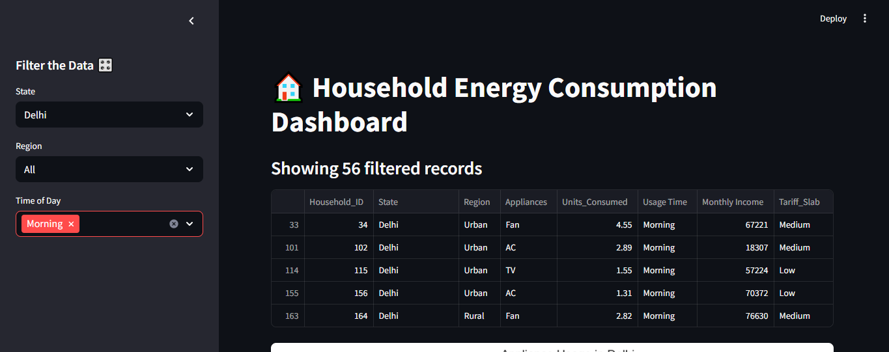
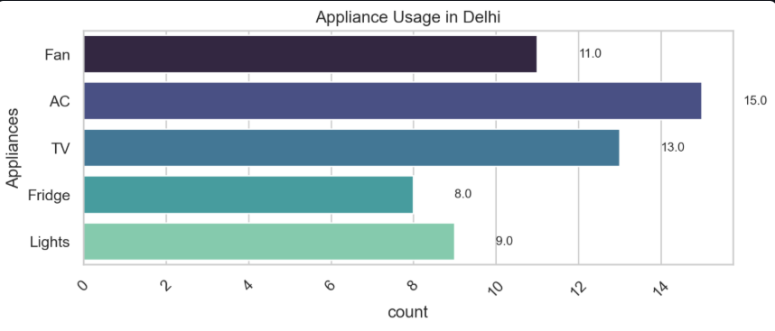
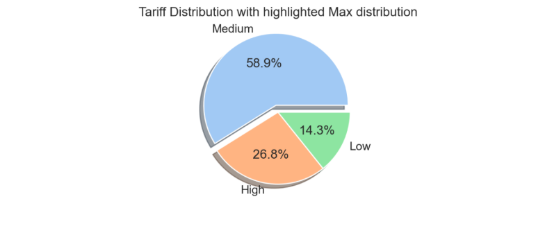
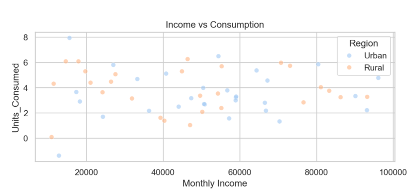

# ⚡ Interactive Energy Consumption Dashboard

---

## ⚙️ Overview

The **Interactive Energy Consumption Dashboard** is a dynamic Streamlit web app that visualizes synthetic energy consumption data across Indian metro cities. Users can explore daily usage, energy type breakdowns, and key statistics using intuitive filters and beautiful visualizations.

> 💡 Built for exploration, powered by Python, and designed to help understand energy patterns at a glance.

---

## 🧠 Features

✅ 30-day synthetic energy usage data  
✅ Filter by **City** and **Month**  
✅ Dynamic KPIs: Total, Average & Max Daily Consumption  
✅ Line chart to show usage trend by day  
✅ Pie chart showing energy type distribution (Solar, Wind, Grid)  
✅ Expandable section to view raw filtered data  

---

## 📸 Preview

---

## 🧰 Tech Stack

| Tool         | Description                          |
|--------------|--------------------------------------|
| 🐍 Python     | Core programming language            |
| 📊 Pandas     | Data handling and filtering          |
| 🔢 NumPy      | Data simulation                      |
| 📈 Seaborn    | Trend visualization (line plots)     |
| 🖼 Matplotlib | Pie charts and detailed styling      |
| 🌐 Streamlit  | Web app framework for dashboards     |

---

## 🧑‍💻 Author

**Keeratjot Kaur**  
✨ *Data Science Enthusiast | Project Coordination*  
📫 [LinkedIn](www.linkedin.com/in/keeratjot-kaur)  

Made with 💖 Python, ☕ caffeine, and a lot of `plt.show()` attempts 😅

---

